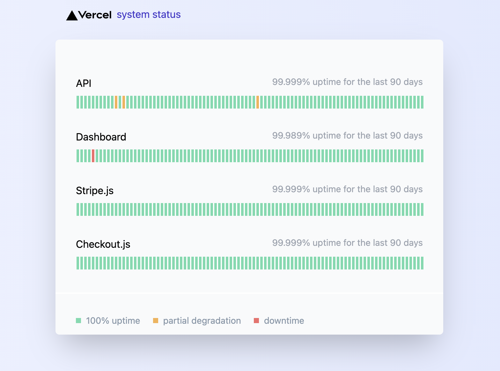

## Desc
This project look like [stripe status](https://status.stripe.com) page, using react & tailwind css & next

It's simple static front end page

status page template

## Preview

----

__Deploy with Vercel__

